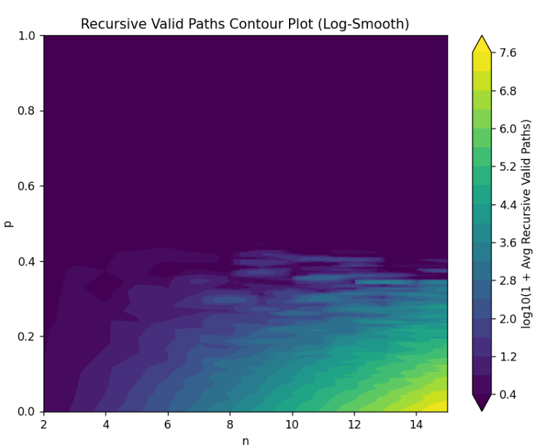
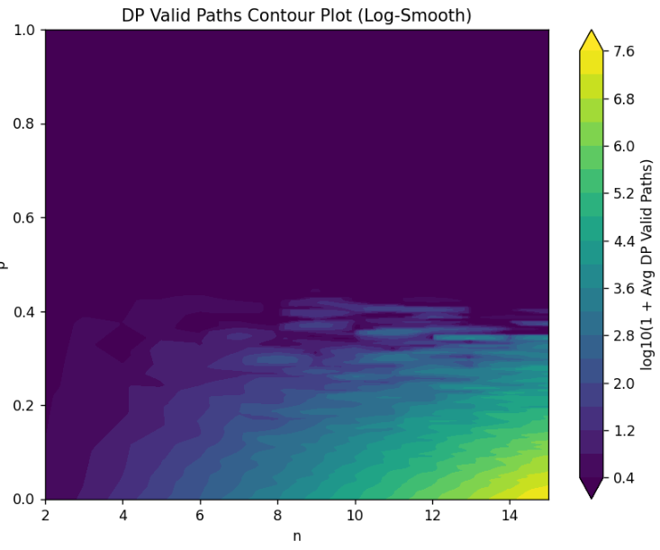
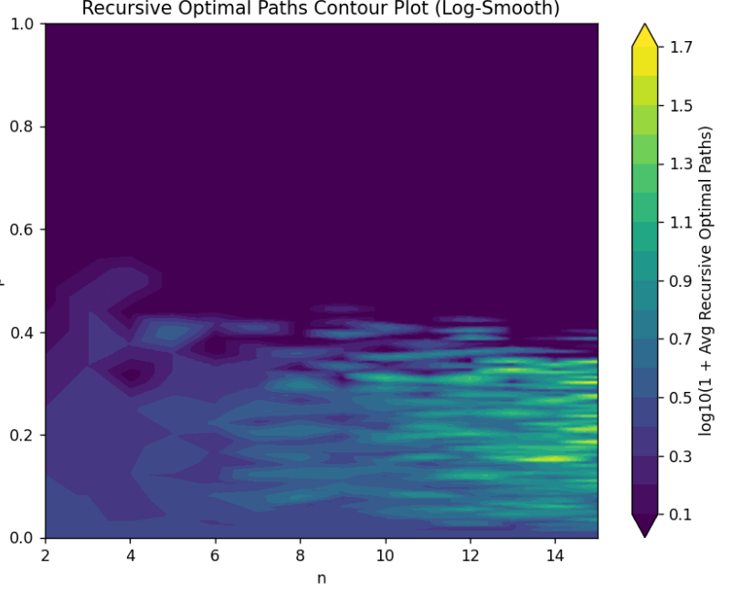
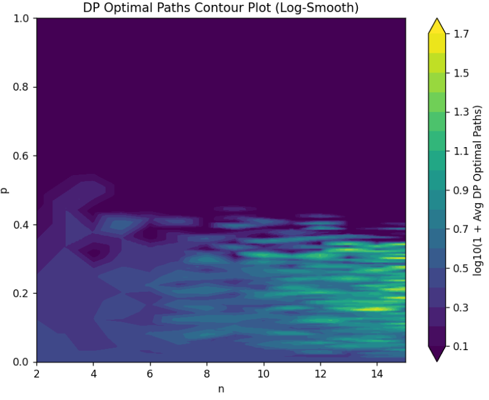
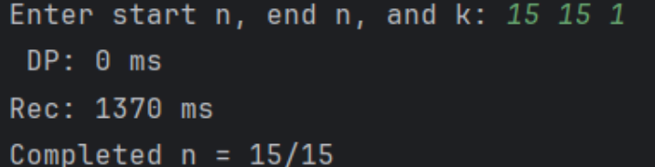
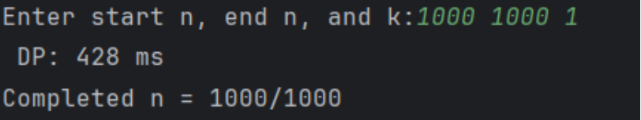

### Grid Implementation
**Files:** `Grid.h` and `Grid.cpp`
- `generateGrid(n)`: Generates an n x n grid.
- `generateObstacle(m)`: Selects m points as obstacles (1), others as free (0).
- `IsObstacle(x, y)`: Checks if (x, y) is an obstacle.
- `length()`: Returns the grid size n.

### Pathfinding Algorithms
**Files:** `PathFinding.h` and `PathFinding.cpp`
- **Grid**: The grid on which algorithms operate.

#### Recursive Approach
- `recursive(int x, int y, int turns, bool fromLeft)`: Recursively explores paths, updating turn counts and optimal paths.
- **Complexity**: Time - $O(2^n)$ (with no obstacles by formula $\frac{2n!}{n!n!}$), Space - O(n) (stack size).

#### Dynamic Programming (DP) Approach
- `DP()`: Records data for each point, updating paths and turns from top and left.
- **Complexity**: Time - $O(n^2)$, Space - $O(n^2)$ (table size).

### Main Program
**File:** `main.cpp`
- Takes input n1 (start) and n2 (end), calculates path counts from density(probability) 0 to 1, and repeats k times to average results.
- Outputs results to a CSV file.
- Uses `plotPath_log` or `plotPath`to generate terrain maps showing:
  - Valid paths (recursive)
  - Optimal paths (DP)
  - Valid paths (DP)
  - Optimal paths (recursive)
### results 
#### Heatmap of path numbers along n and P
- **Valid Path**:  
  - Recursive
    
  - DP
    
- **Optimal Path**:  
  - Recursive
  
  - DP
    
#### running time comparison
- n=10->15  recursive time grow exponentially
- n=1000 DP have a better performance than recursive in n =15

